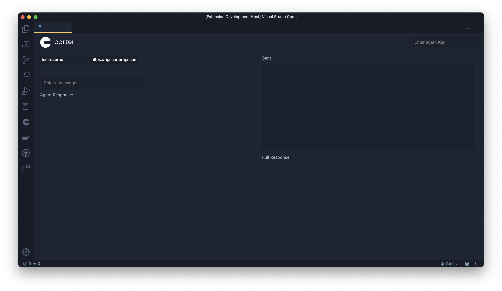

# Carter API Tester

This extension provides a VS-Code friendly way to test your agent's API endpoint. You can configure your agent at
[carterapi.com](https://dashboard.carterapi.com).

## Features

✅ Test your agent outside the Carter Dashboard.
✅ Use your own API key, UUID and even a custom endpoint (for testing middle-man servers etc).
✅ View the entire API response including custom triggers, senitment analysis and more.

## Requirements

You will need a Carter Agent API key, which you can get from [carterapi.com](https://dashboard.carterapi.com).

## Release Notes

This is our first release! We hope you enjoy it.

**Enjoy!**
